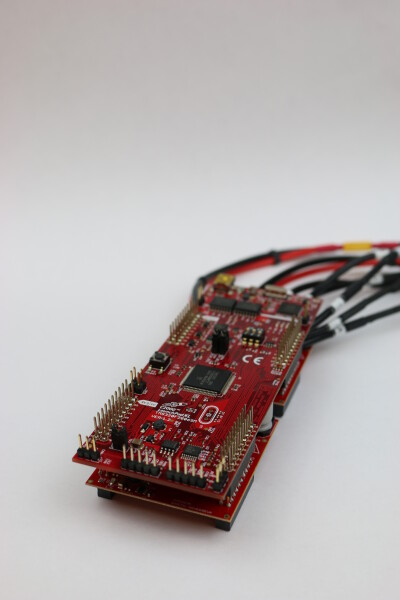
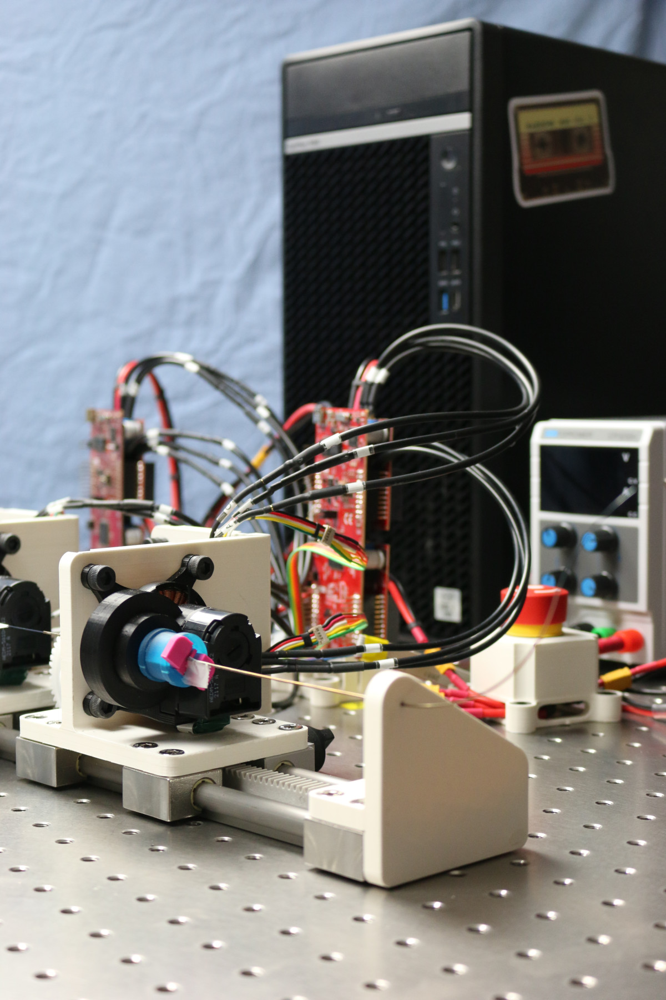
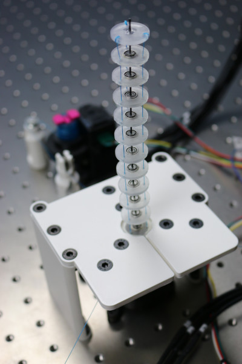
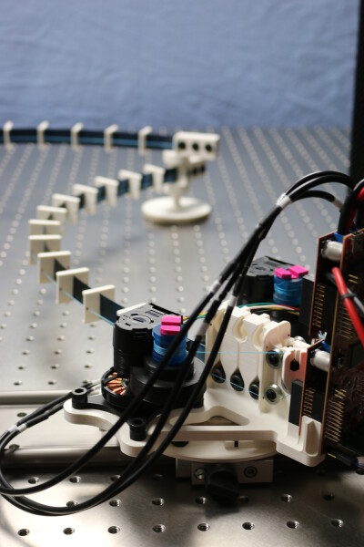

# OpenCR-Hardware

Here we provide CAD design, component lists, assembly instructions, and software for you to create your continuum robot.
The prototypes, parts of them, and extensions can be used to build torque-controlled continuum robot prototypes.
A paper describing the actuation module and three different derived prototypes can be found [here](https://arxiv.org/abs/2304.11850).


*Figure: An actuation module for a wide range of continuum robots*


## Electronics


| TI Evaluation Board                                                                                                       | Consumer PC | Details Wiring |  
|---------------------------------------------------------------------------------------------------------------------------|-------------|----------------|   
| <a href="electronics/Ti_LaunchPad/README.md"></a> | WIP         | WIP            |


## Mechanics


| Concentric Tube Continuum Robot (LOTR CTCR)                                                                             | spatial Tendon-Driven Continuum Robot (LOTR TDCR)                                                                                    | parallel Tendon-Driven Continuum Robot (LOTR TDCR)                                                                                |  
|-------------------------------------------------------------------------------------------------------------------------|--------------------------------------------------------------------------------------------------------------------------------------|-----------------------------------------------------------------------------------------------------------------------------------|   
| <a href="mechanics/LOTR_CTCR/README.md"></a> | <a href="mechanics/LOTR_TDCR-spatial/README.md"></a> | <a href="mechanics/LOTR_TDCR-planar/README.md"></a> |


## More Information


### Further Links

[OpenCR Project](http://opencontinuumrobotics.ca)
<br/>
[Back to Top of Page](README.md)
<br/>
[Electronic Overview](electronics/README.md)
<br/>
[Hardware Overview](mechanics/README.md)

### Authors

Authors are listed in alphabetic order.

- Reinhard M. Grassmann


### License

BSD 3-Clause License

Copyright (c) 2023, Continuum Robotics Laboratory, University of Toronto


### BibTeX

This repository is part of the [OpenCR Project](http://www.opencontinuumrobotics.ca/) and different publications.
If you want to reference this project, you can use the following citation:

```bibtex
    @article{GrassmannBurgner-Kahrs_et_al_Frontiers_2023,
        title       =   {Open Continuum Robotics – One Actuation Module to Create them All},
        author      =   {Grassmann, Reinhard M. and Shentu, Chengnan and Hamoda, Taqi and Triana Dewi, Puspita and Burgner-Kahrs, Jessica},
        journal     =   {Frontiers in Robotics and AI},
        volume      =   {11},
        pages       =   {1272403},
        year        =   {2024},
        doi         =   {10.3389/frobt.2024.1272403}
    }
```
We took great inspiration from the [Open Dynamic Robot Initiative](https://open-dynamic-robot-initiative.github.io/), where efforts are made to build cost-efficient actuators for torque-controlled [legged robots](https://arxiv.org/abs/1910.00093) and [manipulators](https://arxiv.org/abs/2008.03596). 
