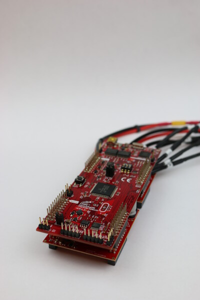

# Ti LaunchPad

The electrical components are similar to the ones initially used by [ODRI](https://github.com/open-dynamic-robot-initiative/open_robot_actuator_hardware/blob/master/electronics/ti_electronics/README.md#texas-instruments-evaluation-board-electronics).

*Figure: Ti LaunchPad with two booster cards*

### Bill of Materials

| Part Name        | Quantity    | Notes                                                | File/Link                                                                                                                                                                                                                                             |  
|------------------|-------------|------------------------------------------------------|-------------------------------------------------------------------------------------------------------------------------------------------------------------------------------------------------------------------------------------------------------|   
| evaluation board | 1           | Ti LaunchPad  (LAUNCHXL-F28069M, Texas Instruments)  | [External Link (DigiKey)](https://www.digikey.ca/en/products/detail/texas-instruments/LAUNCHXL-F28069M/5138373), [External Link (Mouser)](https://www.mouser.ca/ProductDetail/Texas-Instruments/LAUNCHXL-F28069M?qs=3Lzm11LCyi87wcGMs1AZbA%3D%3D)     |
| booster          | 1 or 2      | booster card (BOOSTXL-DRV8305EVM, Texas Instruments) | [External Link (DigiKey)](https://www.digikey.ca/en/products/detail/texas-instruments/BOOSTXL-DRV8305EVM/5761583), [External Link (Mouser)](https://www.mouser.ca/ProductDetail/Texas-Instruments/BOOSTXL-DRV8305EVM?qs=Fobv33ltQGjq5TUavsUsrA%3D%3D) |
| power wire       | 1 or 2      |                                                      | [Instructions]()                                                                                                                                                                                                                                      |
| motor phase      | 1 or 2 sets |                                                      | [Instructions]()                                                                                                                                                                                                                                      |
| CAN cable        | 1           |                                                      | [Instructions]()                                                                                                                                                                                                                                      |
| Encoder cable    | 1 or 2      |                                                      | [Instructions]()                                                                                                                                                                                                                                      |