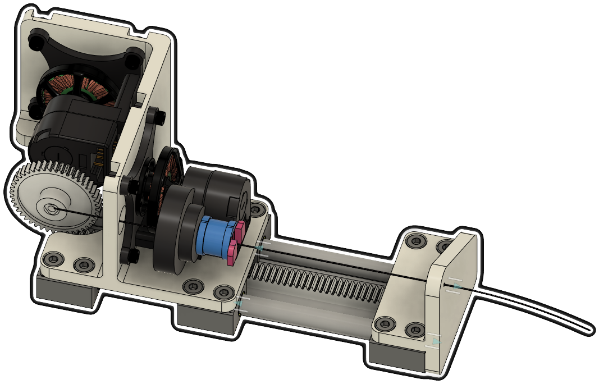
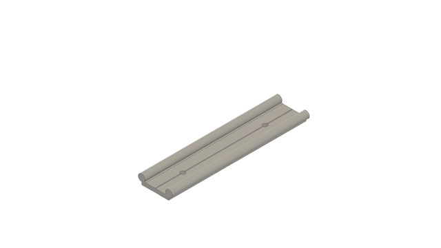
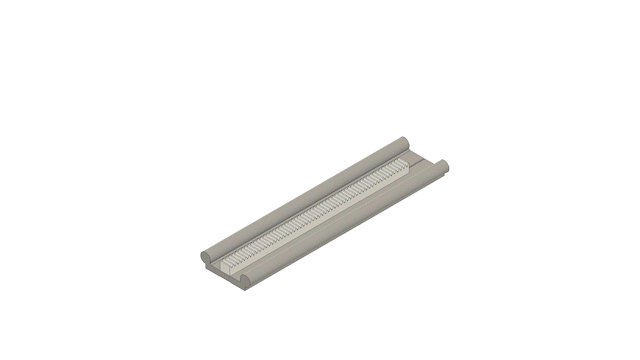
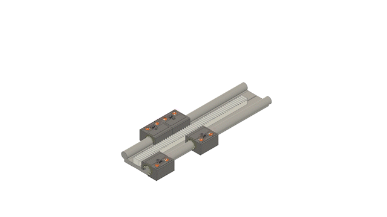
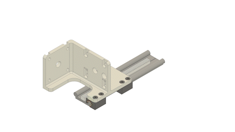
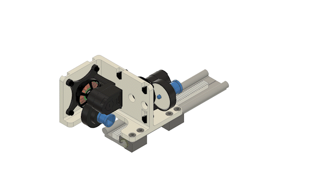
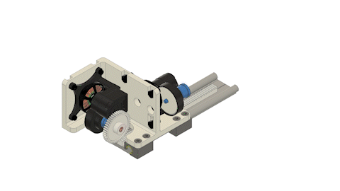
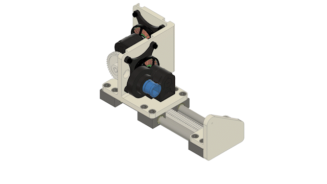

# Concentric Tube Continuum Robot Prototype

Concentric tube continuum robots (CTCR) are a class of continuum robots.
A CTCR consists of multiple nested tubes that are concentric, pre-curved, and super-elastic. 
To generate a motion by changing the centerline of the nested tubes, each tube can be rotated and translated.
The rotational and translational motion can be generated by using two independent motors attached to a carriage. 
We refer to the survey by [Nwafor, Rabenorosoa et al. (T-RO 2023)](https://doi.org/10.1109/TRO.2023.3255512) for a general overview on CTCRs. 

[images of CTCR]

We developed a torque-controlled CTCR with low complexity.

## Electronics Overview

WIP


## Mechanics Overview

WIP


### Tubes

Note that we do not provide tubes.
In general, the flexible tubes are made of a Nitinol or made of thermoplastic materials in some instances. 
The material can be arbitrary as long as the elastic interaction between the tubes can be exploited.
For example

- Thermoplastic material [Amanov, Nguyen & Burgner-Kahrs (SPIE 2015)](https://doi.org/10.1117/12.2081999) and [Morimoto & Okamura (T-RO 2016)](https://doi.org/10.1109/TRO.2016.2602368)
- Nitinol [Sears & Dupont (IROS 2006)](https://doi.org/10.1109/IROS.2006.282072) and [Webster, Okamura & Cowan (IROS 2006)](https://doi.org/10.1109/IROS.2006.282073)

Further references are provided in [Nwafor, Rabenorosoa et al. (T-RO 2023)](https://doi.org/10.1109/TRO.2023.3255512). 
    
We ordered our pre-curved Nitinol tubes from [Euroflex GmbH (Nuernberg, Germany)](https://www.euroflex.de/en/index.html).


### 3D Printed Parts

WIP


### Off-the-shelf Components

WIP

### Bill of Materials for Concentric Tube Continuum Robot Prototype



| Part Name            | Quantity | Notes                                                           | File/Link                                                                                            |  
|----------------------|----------|-----------------------------------------------------------------|------------------------------------------------------------------------------------------------------|   
| Actuation Module     | 2        |                                                                 | [Link](https://github.com/ContinuumRoboticsLab/OpenCR-Hardware/tree/main/mechanics/actuation_module) |
| Main_Frame           | 1        | 3D printed part ([drawing](drawings/Main_Frame_drawing.pdf))    | [STL file](stl_files/Main_Frame.stl)                                                                 |
| Front_Frame          | 1        | 3D printed part ([drawing](drawings/Front_Frame_drawing.pdf))   | [STL file](stl_files/Front_Frame.stl)                                                                |
| Cap Gear             | 1        | 3D printed part ([drawing](drawings/Cap_Gear_8mm_drawing.pdf))  | [STL file](stl_files/Cap_Gear_8mm.stl)                                                               |
| Tube Cap             | 1        | 3D printed part ([drawing](drawings/Tube_coppling_drawing.pdf)) | [STL file](stl_files/Tube_Cap.stl)                                                                   |
| Rail                 | 1        | Igus (P/N WS-10-40))                                            | [External Link](https://www.igus.eu/product/732?artNr=WS-10-40)                                      |
| Pillow Block         | 6        | Igus (P/N WJ200UM-01-10-AL)                                     | [External Link](https://www.igus.ca/product/1165?artNr=WJ200UM-01-10-AL)                             |
| Gear Rack            | 1        | McMaster-Carr (P/N 2662N57)                                     | [External Link](https://www.mcmaster.com/2662N57/)                                                   |
| Gear                 | 1        | McMaster-Carr (P/N 2662N42)                                     | [External Link](https://www.mcmaster.com/2662N42/)                                                   |
| M6x14 Screw          | 20       | McMaster-Carr (P/N 91290A319)                                   | [External Link](https://www.mcmaster.com/91290A319/)                                                 |
| M6 Nut               | 8        | McMaster-Carr (P/N 90593A005)                                   | [External Link](https://www.mcmaster.com/90593A005/)                                                 |
| Pre-curved NiTi Tube | 1        | Euroflex                                                        | [External Link](https://www.euroflex.de/en/index.html)                                               |


## Step-by-Step Instructions

Step 1: Assemble the [gear rack](https://www.mcmaster.com/2662N57/) onto the [rail](https://www.igus.eu/product/732?artNr=WS-10-40).



Step 2: Assemble 4 [pillow blocks](https://www.igus.ca/product/1165?artNr=WJ200UM-01-10-AL) onto the rail. 



Step 3: Assemble the [main frame](stl_files/Main_Frame.stl) to the rail system with 8 [M6x14 screws](https://www.mcmaster.com/91290A319/).



Step 4: Assemble 2 [actuation modules](https://github.com/ContinuumRoboticsLab/OpenCR-Hardware/tree/main/mechanics/actuation_module) to the main frame with 4 [M6x14 screws](https://www.mcmaster.com/91290A319/) and 4 [M6 nuts](https://www.mcmaster.com/90593A005/) for each actuation module.



Step 5: Assemble the [gear](https://www.mcmaster.com/2662N42/) to the rear actuation module using the [cap gear](stl_files/Cap_Gear_8mm.stl).



Step 6: Assemble the [front frame](stl_files/Front_Frame.stl) to the rail system with 8 [M6x14 screws](https://www.mcmaster.com/91290A319/).



Step 7: Assemble the [pre-curved Nitinol tube](https://www.euroflex.de/en/index.html) to the front actuation module using the [tube cap](stl_files/Tube_Cap.stl).




## More Information

### Further Links

[OpenCR Project](http://opencontinuumrobotics.ca)
<br/>
[Back to Top of Page](README.md)
<br/>
[Electronic Overview](electronics/README.md)
<br/>
[Hardware Overview](mechanics/README.md)

### Authors

Authors are listed in alphabetic order.

- Puspita Triana Dewi
- Reinhard M. Grassmann


### License

BSD 3-Clause License

Copyright (c) 2023, Continuum Robotics Laboratory, University of Toronto


### BibTeX

This design is part of the [OpenCR Project](http://www.opencontinuumrobotics.ca/).
If you want to reference this design, you can use the following citation:

```bibtex
    @article{GrassmannBurgner-Kahrs_et_al_arXiv_2023,
        title       =   {Open Continuum Robotics – One Actuation Module to Create them All},
        author      =   {Grassmann, Reinhard M. and Shentu, Chengnan and Hamoda, Taqi and Triana Dewi, Puspita and Burgner-Kahrs, Jessica},
        journal     =   {arXiv preprint arXiv:2304.11850},
        year        =   {2023},
        doi         =   {10.48550/arXiv.2304.11850}
    }
```

### Trivia

LOTR stands for Lord of the Ring, in reference to the title of the paper. Yes, the movie.
