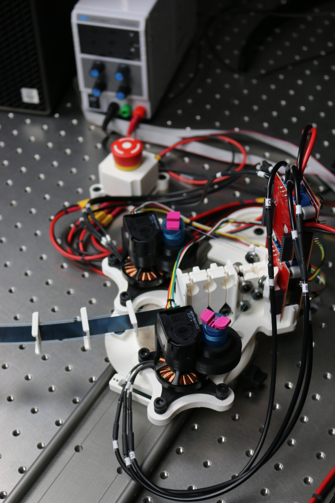
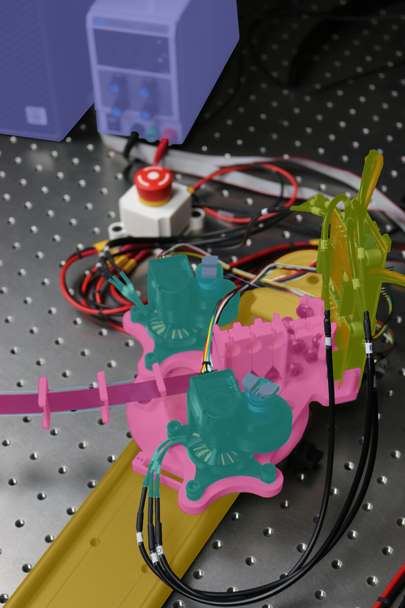

# Planar Tendon-Driven Continuum Robot Prototype

A parallel continuum robot (PCR) tries to combine the world of rigid parallel robots and continuum robots.
This one is a planar PCR, where the beam is tendon-actuated.
It has two bases rigid linked at the distal end of the beam.

<p float="left">


</p>

*Figure: Image of one base of the PCR. Right images shows a classification of the component. (cyan) actuation modules, (red) frames, (green) evaluation boards, (yellow) guiding rail, and (blue) consumer pc with power supply.*


## Electronics Overview

WIP


## Mechanics Overview

WIP

### 3D Printed Parts

WIP


### Off-the-shelf Components

WIP


### Step-by-Step Instructions

WIP

### Bill of Materials for Planar Tendon-Driven Continuum Robot Prototype 


| Part Name                       | Quantity | Notes                                                                        | File/Link                                                                                                                                                                                                                    |  
|---------------------------------|----------|------------------------------------------------------------------------------|------------------------------------------------------------------------------------------------------------------------------------------------------------------------------------------------------------------------------|   
| Actuation Module                | 2        |                                                                              | [Link](https://github.com/ContinuumRoboticsLab/OpenCR-Hardware/tree/main/mechanics/actuation_module)                                                                                                                         |
| Turret Frame                    | 1        | 3D printed part ([drawing](drawings/Frame_turret_drawing.pdf))               | [STL file](stl_files/frame_turret.stl)                                                                                                                                                                                       |
| Base Plate                      | 1        | 3D printed part ([drawing](drawings/Frame_base_plate_drawing.pdf))           | [STL file](stl_files/frame_base_plate.stl)                                                                                                                                                                                   |
| Glider                          | 1        | 3D printed part ([drawing](drawings/EE_glider_small_drawing.pdf))            | [STL file](stl_files/EE_glider_small.stl)                                                                                                                                                                                    |
| Spacer Disk                     | 9        | 3D printed part ([drawing](drawings/Spacer_Disk_drawing.pdf))                | [STL file](stl_files/spacer_disk.stl)                                                                                                                                                                                        |
| End Effector                    | 1        | 3D printed part ([drawing](drawings/EE_middle_drawing.pdf))                  | [STL file](stl_files/EE_middle.stl)                                                                                                                                                                                          |
| Rail-to-Table Connector (Right) | 1        | 3D printed part ([drawing](drawings/rail2table_connector_right_drawing.pdf)) | [STL file](stl_files/rail2table_connector_right.stl)                                                                                                                                                                         |
| Rail-to-Table Connector (Left)  | 1        | 3D printed part ([drawing](drawings/Rail2table_connector_left_drawing.pdf))  | [STL file](stl_files/rail2table_connector_left.stl)                                                                                                                                                                          |
| Felt Pad                        | 1        | Off-the-shelf component (Amazon)                                             | [External Link](https://www.amazon.ca/Scotch-SP828-NA-Round-Furniture-Brown/dp/B01MTMXCGC/ref=sr_1_4?crid=2CS0CEP2WS7PA&keywords=felt%2Bpads%2B3%22&qid=1685066557&s=hi&sprefix=felt%2Bpads%2B3%2B%2Ctools%2C89&sr=1-4&th=1) |
| Pulley                          | 8        | Off-the-shelf component (Amazon)                                             | [External Link](https://www.amazon.ca/V623ZZ-Groove-Bearing-Carbon-3x12x4mm/dp/B07CV8CW1F)                                                                                                                                   |
| Rail                            | 1        | Igus (P/N WS-10-40)                                                          | [External Link](https://www.igus.eu/product/732?artNr=WS-10-40)                                                                                                                                                              |
| Pillow Block                    | 4        | Igus (P/N WJ200UM-01-10-AL)                                                  | [External Link](https://https://www.igus.ca/product/1165?artNr=WJ200UM-01-10-AL)                                                                                                                                             |
| M6x14 Screw                     | 12       | McMaster-Carr (P/N 91290A319)                                                | [External Link](https://www.mcmaster.com/91290A319/)                                                                                                                                                                         |
| M6 Nut                          | 8        | McMaster-Carr (P/N 90593A005)                                                | [External Link](https://www.mcmaster.com/90593A005/)                                                                                                                                                                         |
| Beam                            | 1        | McMaster-Carr (P/N 9075K79)                                                  | [External Link](https://www.mcmaster.com/9075K79/)                                                                                                                                                                           |
| Tendon                          | 2        | McMaster-Carr (P/N 9442T4)                                                   | [External Link](https://www.mcmaster.com/9442T4/)                                                                                                                                                                            |


## More Information

### Further Links

[OpenCR Project](http://opencontinuumrobotics.ca)
<br/>
[Back to Top of Page](README.md)
<br/>
[Electronic Overview](electronics/README.md)
<br/>
[Hardware Overview](mechanics/README.md)

### Authors

Authors are listed in alphabetic order.

- Puspita Triana Dewi
- Reinhard M. Grassmann


### License

BSD 3-Clause License

Copyright (c) 2023, Continuum Robotics Laboratory, University of Toronto


### BibTeX

This design is part of the [OpenCR Project](http://www.opencontinuumrobotics.ca/).
If you want to reference this design, you can use the following citation:

```bibtex
    @article{GrassmannBurgner-Kahrs_et_al_Frontiers_2023,
        title       =   {Open Continuum Robotics – One Actuation Module to Create them All},
        author      =   {Grassmann, Reinhard M. and Shentu, Chengnan and Hamoda, Taqi and Triana Dewi, Puspita and Burgner-Kahrs, Jessica},
        journal     =   {Frontiers in Robotics and AI},
        volume      =   {11},
        pages       =   {1272403},
        year        =   {2024},
        doi         =   {10.3389/frobt.2024.1272403}
    }
```

### Trivia

LOTR stands for Lord of the Ring, in reference to the title of the paper. Yes, the movie.
