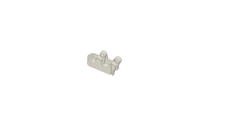
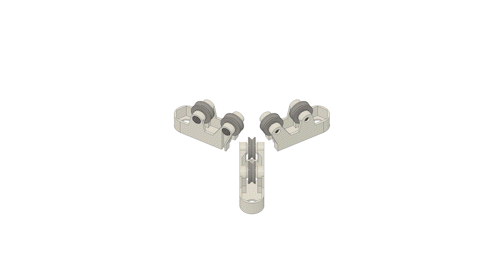
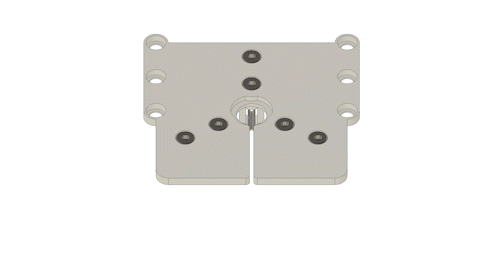
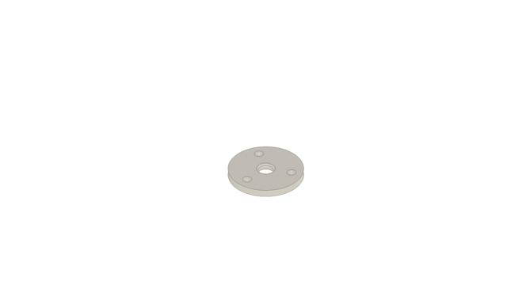
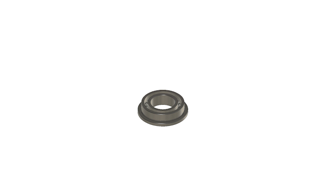
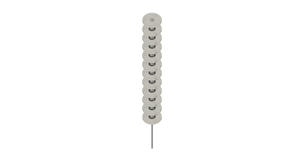
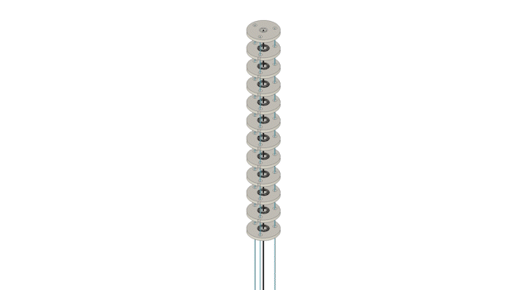
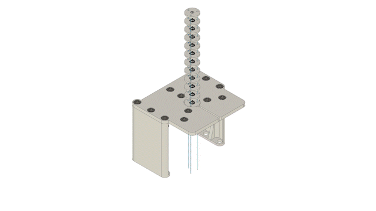
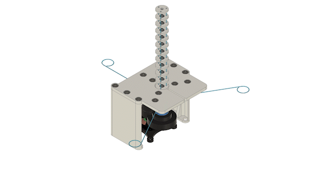

# Spatial Tendon-Driven Continuum Robot Prototype

A tendon-driven continuum robot (TDCR) is composed of a flexible backbone along which tendons are guided using spacer disks, these last ones being fixed to the backbone. 
It is actuated by changing the tendons’ length and applying tendon tensions, which cause a reversible deformation of the backbone.
This one has one [type-II segment](https://www.frontiersin.org/articles/10.3389/frobt.2022.873446/full) and three tendons.

<p float="left">


</p>

*Figure: Image of a TDCR with three degrees of freedom. Right images shows a classification of the component. (cyan) actuation modules, (red) frames, (green) evaluation boards, and (blue) consumer pc with power supply.*


## Electronics Overview

WIP


## Mechanics Overview

WIP

## 3D Printed Parts

WIP


## Off-the-shelf Components

WIP


## Bill of Materials for Spatial Tendon-Driven Continuum Robot Prototype


| Part Name            | Quantity | Notes                                                                          | File/Link                                                                                            |  
|----------------------|----------|--------------------------------------------------------------------------------|------------------------------------------------------------------------------------------------------|   
| Actuation Module     | 4        |                                                                                | [Link](https://github.com/ContinuumRoboticsLab/OpenCR-Hardware/tree/main/mechanics/actuation_module) |
| Base Platform        | 1        | 3D printed part ([drawing](drawings/BasePlatform_drawing.pdf))                 | [STL file](stl_files/BasePlatform.stl)                                                               |
| Base Platform Wall   | 2        | 3D printed part ([drawing](drawings/BasePlatform_wall_drawing.pdf))            | [STL file](stl_files/BasePlatform_wall.stl)                                                          |
| Pulley Holder        | 3        | 3D printed part ([drawing](drawings/BasePlatform_PullyHolder_Drawing.pdf))     | [STL file](stl_files/BasePlatform_PullyHolder.stl)                                                   |
| Pulley Shaft         | 6        | 3D printed part ([drawing](drawings/Shaft_pulley_drawing.pdf))                 | [STL file](stl_files/BasePlatform_PulleyShaft.stl)                                                   |
| Disk without Dent    | 1        | 3D printed part ([drawing](drawings/FSD_20mm_bearing_withoutDent_Drawing.pdf)) | [STL file](stl_files/FSD_20mm_bearing_withoutDent.stl)                                               |
| Disk                 | 10       | 3D printed part ([drawing](drawings/Disk_drawing v1.pdf))                      | [STL file](stl_files/FSD_20mm_bearing.stl)                                                           |
| End Disk             | 1        | 3D printed part ([drawing](drawings/FSDzero_20mm_withoutDent_drawing.pdf))     | [STL file](stl_files/FSDzero_20mm.stl)                                                               |
| Inner Disk           | 12       | 3D printed part ([drawing](drawings/FSD_bearing_inner_Drawing.pdf))            | [STL file](stl_files/FSD_bearing_inner.stl)                                                          |
| Tube Coupling        | 1        | 3D printed part ([drawing](drawings/Tube_coppling_1mm_drawing.pdf))            | [STL file](stl_files/Tube_coppling_1mm.stl)                                                          |
| Bearing              | 11       | McMaster-Carr (P/N 57155K438)                                                  | [External link](https://www.mcmaster.com/57155K438/)                                                 |
| Backbone (NiTi Tube) | 1        | Off-the-shelf component                                                        |                                                                                                      |
| Tendon               | 1        | McMaster-Carr (P/N 9442T4)                                                     | [External link](https://www.mcmaster.com/9442T4/)                                                    |
| Pulley               | 6        | Off-the-shelf component (Amazon)                                               | [External link](https://www.amazon.ca/V623ZZ-Groove-Bearing-Carbon-3x12x4mm/dp/B07CV8CW1F)           |
| M6x8 Screw           | 12       | McMaster-Carr (P/N 93070A139)                                                  | [External link](https://www.mcmaster.com/93070A139/)                                                 |
| M6 Nut               | 12       | McMaster-Carr (P/N 90593A005)                                                  | [External link](https://www.mcmaster.com/90593A005/)                                                 |


## Step-by-Step Instructions

Step 1: Assemble 2 [pulleys](https://www.amazon.ca/V623ZZ-Groove-Bearing-Carbon-3x12x4mm/dp/B07CV8CW1F) into the puley [holder](stl_files/BasePlatform_PullyHolder.stl) with [pulley shaft](stl_files/BasePlatform_PulleyShaft). Do this for 3 sets of pulley systems.



Step 2: Assemble the pulley system to the bottom side of the [base platform](stl_files/BasePlatform.stl) using [M6 screws](https://www.mcmaster.com/93070A139/) and [M6 nuts](https://www.mcmaster.com/90593A005/).



Step 3: Assemble the [base platform](stl_files/BasePlatform.stl) to the [base platform wall](stl_files/BasePlatform_wall.stl) using [M6 screws](https://www.mcmaster.com/93070A139/) and [M6 nuts](https://www.mcmaster.com/90593A005/).



Step 4: Insert the [inner disk](stl_files/FSD_bearing_inner.stl) into the [end disk](stl_files/FSDzero_20mm.stl).



Step 5: Insert the [inner disk](stl_files/FSD_bearing_inner.stl) into the [bearing](https://www.mcmaster.com/57155K438/). Do this for 11 sets of bearings.



Step 6: Insert the bearing into 10 [disks](stl_files/FSD_20mm_bearing.stl) and 1 [disk without dent](stl_files/FSD_20mm_bearing_withoutDent.stl).


Step 7: Arrange the disks to the backbone in equidistant. The arrangement should be (from top to bottom) end disk --> 10 disks --> disk without dent. Make sure that the tendon holes are in a straight line from top to the bottom.


Step 8: Route the tendon along the tendon holes. Tie a knot at the end disk as a determination point. Do this for 3 sets of tendons.



Step 9: Assemble the continuum robot to the base platform using [M6 screws](https://www.mcmaster.com/93070A139/) and [M6 nuts](https://www.mcmaster.com/90593A005/).



Step 10: Assemble the backbone to the [actuation module](https://github.com/ContinuumRoboticsLab/OpenCR-Hardware/tree/main/mechanics/actuation_module) using [tube coupling](stl_files/Tube_coppling_1mm.stl).



Step 11: Attach each tendon to one [actuation module](https://github.com/ContinuumRoboticsLab/OpenCR-Hardware/tree/main/mechanics/actuation_module) though the pulley system.



## More Information

### Further Links

[OpenCR Project](http://opencontinuumrobotics.ca)
<br/>
[Back to Top of Page](README.md)
<br/>
[Electronic Overview](electronics/README.md)
<br/>
[Hardware Overview](mechanics/README.md)

### Authors

Authors are listed in alphabetic order.

- Puspita Triana Dewi
- Reinhard M. Grassmann


### License

BSD 3-Clause License

Copyright (c) 2023, Continuum Robotics Laboratory, University of Toronto


### BibTeX

This design is part of the [OpenCR Project](http://www.opencontinuumrobotics.ca/).
If you want to reference this design, you can use the following citation:

```bibtex
    @article{GrassmannBurgner-Kahrs_et_al_Frontiers_2023,
        title       =   {Open Continuum Robotics – One Actuation Module to Create them All},
        author      =   {Grassmann, Reinhard M. and Shentu, Chengnan and Hamoda, Taqi and Triana Dewi, Puspita and Burgner-Kahrs, Jessica},
        journal     =   {Frontiers in Robotics and AI},
        volume      =   {11},
        pages       =   {1272403},
        year        =   {2024},
        doi         =   {10.3389/frobt.2024.1272403}
    }
```

### Trivia

LOTR stands for Lord of the Ring, in reference to the title of the paper. Yes, the movie.
