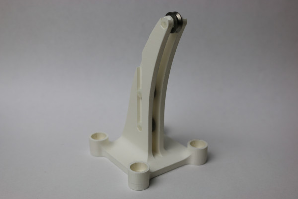

# Toy Examples

To evaluate the proposed actuation module, two different toy examples are used.

---
## Toy Example: Hanging Weight
The first toy example is simply a system of pulleys. 



*Figure 1: First toy example*


## More Information

### Further Links

[OpenCR Project](http://opencontinuumrobotics.ca)
<br/>
[Back to Top of Page](README.md)
<br/>
[Electronic Overview](electronics/README.md)
<br/>
[Hardware Overview](mechanics/README.md)

### Authors

Authors are listed in alphabetic order.

- Puspita Triana Dewi
- Reinhard M. Grassmann


### License

BSD 3-Clause License

Copyright (c) 2023, Continuum Robotics Laboratory, University of Toronto


### BibTeX

This design is part of the [OpenCR Project](http://www.opencontinuumrobotics.ca/).
If you want to reference this design, you can use the following citation:

```bibtex
    @article{GrassmannBurgner-Kahrs_et_al_Frontiers_2023,
        title       =   {Open Continuum Robotics – One Actuation Module to Create them All},
        author      =   {Grassmann, Reinhard M. and Shentu, Chengnan and Hamoda, Taqi and Triana Dewi, Puspita and Burgner-Kahrs, Jessica},
        journal     =   {Frontiers in Robotics and AI},
        volume      =   {11},
        pages       =   {1272403},
        year        =   {2024},
        doi         =   {10.3389/frobt.2024.1272403}
    }
```

### Trivia

LOTR stands for Lord of the Ring, in reference to the title of the paper. Yes, the movie.
