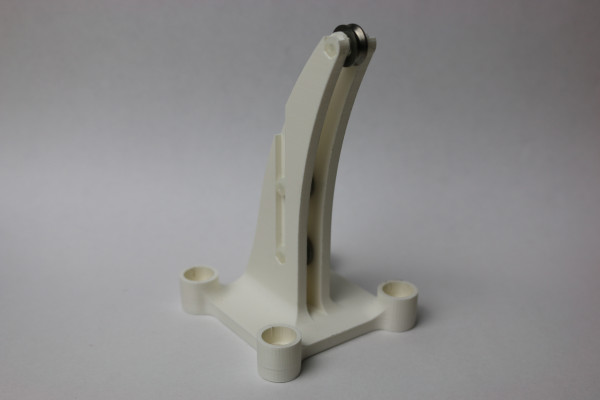

# Toy Examples

To evaluate the proposed actuation module, two different toy examples are used.

---
## Toy Example: Hanging Weight
The first toy example is simply a system of pulleys. 

*First toy example*

---
### Trivia

LOTR stands for Lord of the Ring, in reference to the title of the paper. Yes, the movie.
