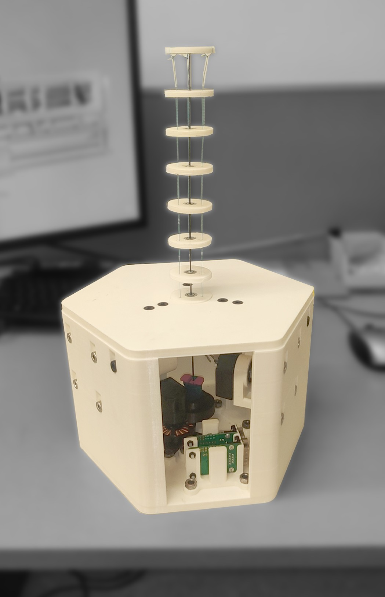

# Learning Kit for Tendon-driven Continuum Robot Prototype

A tendon-driven continuum robot (TDCR) is composed of a flexible backbone along which tendons are guided using spacer disks, these last ones being fixed to the backbone. 
It is actuated by changing the tendons’ length and applying tendon tensions, which cause a reversible deformation of the backbone.
This prototype has a segment with [type-II spacer disks (Grassmann et al., FRobt 2022)](https://www.frontiersin.org/articles/10.3389/frobt.2022.873446/full) and three tendons.

*Figure: CAD image and foto of a Learning Kit.*

## Electronics Overview

WIP

## Mechanics Overview

The manipulator of the TDCR consists of 10 type-II spacer disks equally distributed along a Nitinol Backbone with a diameter of 1.4 mm. 
The robot is capable of 3 DOFs, namely bending across two planes and rotation about its axis. 
Three independently actuated tendons made of Spectra Fiber and an actuator to rotate the backbone are used to enable these degrees of freedom. 

The body of the spacer disk is fixed to the backbone axially, while a bearing in the middle enables the rotational DOF. 
It is split into two parts to enable the insertion of the bearing in the middle. 
I changed the regular ball bearing to a pulley to reduce the number of unique components. 
The profile of the two parts allows for easy assembly while ensuring that the actuation through the tendons is optimal. 
The grooves ensure the adhesive stays inside the segment and does not spill out. 
The FSD Backbone Clamp functions as a spacer to make the pulley bore smaller. 
It is designed with a unique profile that balances the required friction to grip the backbone and the need for a constant curvature. 

All components are placed inside a hexagonal casing with windows made of transparent acrylic sheets to view the system’s working. 
The three tendon actuators are fixed horizontally to reduce tendon routing. 
Six pulleys are placed inside to help reduce the tendon offset and increase the efficiency of tendon control. 
An actuation module is placed at the bottom and controls backbone rotation. 
To secure the electric components in the case, custom 3D-printed mounts have been designed. 
All components are placed in a way visible from the windows to allow the user to see the robot’s functioning, allowing better understanding and enabling the development of intuition.

The previously used [actuation module (Grassmann et al., ArXiv 2023)](https://www.frontiersin.org/articles/10.3389/frobt.2022.873446/full) was modified to suit this kit’s requirements. 
The multipart casing is replaced with a single unit. 
A new casing is designed to be easier to manufacture and maintain adequate performance. 
The assembly process is simplified as the singular casing eliminates input and output shaft misalignment. 
The motor and the gears can easily fit into designated spaces using dedicated slots. 
Since the actuator will only actuate tendons, an extra bearing is introduced at the output shaft to handle the increased radial tension and eliminate shaft eccentricity. 

## Bill of Materials for Spatial Tendon-Driven Continuum Robot Prototype

| Part Name                          | Quantity | Notes                            | File/Link                                                                                                           |
|------------------------------------|----------|----------------------------------|---------------------------------------------------------------------------------------------------------------------|
| Base Casing                        | 1        | 3D Printed Part                  | [STL File](stl_files/Base_Casing.stl)                                                                               |
| Hexagon Top                        | 1        | 3D Printed Part                  | [STL File](stl_files/Hexagon_Top.stl)                                                                               |
| Pulley Holder                      | 3        | 3D Printed Part                  | [STL File](stl_files/Pulley_Holder.stl)                                                                             |
| Stand_for_CAN                      | 1        | 3D Printed Part                  | [STL File](stl_files/Stand_for_CAN.stl)                                                                             |
| Stand_for_LaunchPad                | 2        | 3D Printed Part                  | [STL File](stl_files/Stand_for_LaunchPad.stl)                                                                       |
| M6 Nuts                            | 40       | McMaster Carr (P/N 91828A251)    | [External Link](https://www.mcmaster.com/91828A251/)                                                                |
| M6x16 Bolts                        | 9        | McMaster Carr (P/N 91292A135)    | [External Link](https://www.mcmaster.com/91292A135/)                                                                |
| M6x20 Bolts                        | 31       | McMaster Carr (P/N 92855A619)    | [External Link](https://www.mcmaster.com/92855A619/)                                                                |
| Acrylic Sheets                     | 1        | Needs to be cut into 3 parts     | [External Link](https://www.mcmaster.com/8560K163/)                                                                 |
| Pulley                             | 6        | Off-the-shelf component (Amazon) | [External Link](https://www.amazon.ca/V623ZZ-Groove-Bearing-Carbon-3x12x4mm/dp/B07CV8CW1F)                          |
| Velcro – 1/4 inch wide             | 50 feet  | McMaster Carr (P/N 9273K5)       | [External Link](https://www.mcmaster.com/9273K5/)                                                                   |
| FSD Sliced                         | 7        | 3D Printed Part                  | [STL File](stl_files/FSD_Sliced.stl)                                                                                |
| FSD Sliced 2                       | 7        | 3D Printed Part                  | [STL File](stl_files/FSD_Sliced_2.stl)                                                                              |
| FSD Backbone Clamp                 | 7        | 3D Printed Part                  | [STL File](stl_files/FSD_Backbone_Clamp.stl)                                                                        |
| FSD Top                            | 1        | 3D Printed Part                  | [STL File](stl_files/FSD_Top.stl)                                                                                   |
| Backbone (NiTi Tube)               | 1        | Off-the-shelf component          |                                                                                                                     |
| Tendon                             | 1        | McMaster-Carr (P/N 9442T4)       | [External Link](https://www.mcmaster.com/9442T4/)                                                                   |
| Pulley                             | 7        | Off-the-shelf component (Amazon) | [External Link](https://www.amazon.ca/V623ZZ-Groove-Bearing-Carbon-3x12x4mm/dp/B07CV8CW1F)                          |
| Shaft_GearCoupling for Tendon      | 3        | 3D Printed Part                  | [STL File](stl_files/ShaftGearCoupling_for_Tendon.stl)                                                              |
| Casing for Tendon Actuation Module | 3        | 3D Printed Part                  | [STL File](stl_files/ShaftGearCoupling_for_Tendon.stl)                                                              |
| Shaft_MotorEncoder for Tendon      | 3        | 3D Printed Part                  | [STL File](stl_files/Casing_for_Tendon_Actuation_Module.stl)                                                        |
| Ball Bearing                       | 9        | McMaster Carr (P/N 5972K910)     | [External Link](https://www.mcmaster.com/5972K91/)                                                                  |
| Motor                              | 3        | T-Motor MN4004                   | [External Link](https://store.tmotor.com/goods-438-Antigravity+MN4004+KV300+-+2PCSSET.html)                         |
| Gear_Motor                         | 3        | McMaster Carr (P/N 2662N313)     | [External Link](https://www.mcmaster.com/2662N313/)                                                                 |
| Gear_Encoder                       | 3        | McMaster Carr (P/N 2662N321)     | [External Link](https://www.mcmaster.com/2662N321/)                                                                 |
| Encoder                            | 3        | Avago AEDM-5810                  | [External Link](https://www.mouser.ca/ProductDetail/Broadcom-Avago/AEDM-5810-Z12?qs=nm95cbFn36yryX%2Fd2Onjlw%3D%3D) |
| External Retaining Ring - 8mm      | 6        | McMaster Carr (P/N 98541A116)    | [External Link](https://www.mcmaster.com/98541A116/)                                                                |
| Screw M3x10                        | 9        | McMaster Carr (P/N 91290A115)    | [External Link](https://www.mcmaster.com/91290A115/)                                                                |
| Nut M3                             | 9        | McMaster Carr (P/N 90593A001)    | [External Link](https://www.mcmaster.com/90593A001/)                                                                |
| Actuation Module                   | 1        | Assembly                         | [Link](https://github.com/ContinuumRoboticsLab/OpenCR-Hardware/tree/main/mechanics/actuation_module)                |

## Step-by-Step Instructions

For a detailed assembly guide, follow this [link to see the accompanying video](https://youtu.be/REcu881jMmQ)!

## More Information

WIP

### Further Links

[OpenCR Project](http://opencontinuumrobotics.ca)
 
[Back to Top of Page](README.md)
 
[Electronic Overview](electronics/README.md)
 
[Hardware Overview](mechanics/README.md)

### Authors

Authors are listed in alphabetic order.

- Ankit Aggarwal
- Reinhard M. Grassmann

### License

BSD 3-Clause License

Copyright (c) 2023, Continuum Robotics Laboratory, University of Toronto

### BibTeX

This design is part of the [OpenCR Project](https://www.opencontinuumrobotics.com/).
Corresponding blog post: [Learning Kit for Tendon-driven Continuum Robots](https://www.opencontinuumrobotics.com/hands-on/2023/10/11/learning-kit.html).
