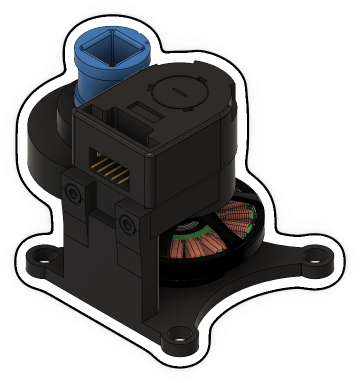

# OpenCR-Hardware Actuation Module

## Bill of Materials for one Actuation Module

| Part Name                          | Quantity | Notes                                                                | File/Link                                                                                                   |  
|------------------------------------|----------|----------------------------------------------------------------------|-------------------------------------------------------------------------------------------------------------|   
| ActuationUnit_MotorSide_Cube       | 1        | 3D printed part ([drawing](drawings/Motor_Frame.pdf))                | [STL file](stl_files/ActuationUnit_EncoderCouplingSide.stl)                                                 |
| Motor                              | 1        | T-Motor MN4004                                                       | [Link](https://store.tmotor.com/goods-438-Antigravity+MN4004+KV300+-+2PCSSET.html)                          |
| Gear_Motor                         | 1        | McMaster Carr (P/N 2662N313)                                         | [Link](https://www.mcmaster.com/2662N313/)                                                                  |
| Gear_Encoder                       | 1        | McMaster Carr (P/N 2662N321)                                         | [Link](https://www.mcmaster.com/2662N321/)                                                                  |
| ActuationUnit_EncoderCouplingSide  | 1        | 3D printed part ([drawing](drawings/Encoder_Frame.pdf))              | [STL file](stl_files/ActuationUnit_MotorSide_Cube.stl)                                                      |
| Ball Bearing                       | 2        | McMaster Carr (P/N 5972K910)                                         | [Link](https://www.mcmaster.com/5972K91/)                                                                   |
| Shaft_GearCoupling                 | 1        | 3D printed part ([drawing](drawings/Shaft_GearCoupling_Drawing.pdf)) | [STL file](stl_files/Shaft_GearCoupling.stl)                                                                |
| Shaft_MotorEncoder                 | 1        | 3D printed part ([drawing](Shaft_MotorEncoder_Drawing.pdf))          | [STL file](stl_files/Shaft_MotorEncoder.stl)                                                                |
| Screw M3x10                        | 2        | McMaster Carr (P/N 91290A115)                                        | [Link](https://www.mcmaster.com/91290A115/)                                                                 |
| Nut M3                             | 2        | McMaster Carr (P/N 90593A001)                                        | [Link](https://www.mcmaster.com/90593A001/)                                                                 |
| Encoder                            | 1        | Avago AEDM-5810                                                      | [Link](https://www.mouser.ca/ProductDetail/Broadcom-Avago/AEDM-5810-Z12?qs=nm95cbFn36yryX%2Fd2Onjlw%3D%3D ) |

